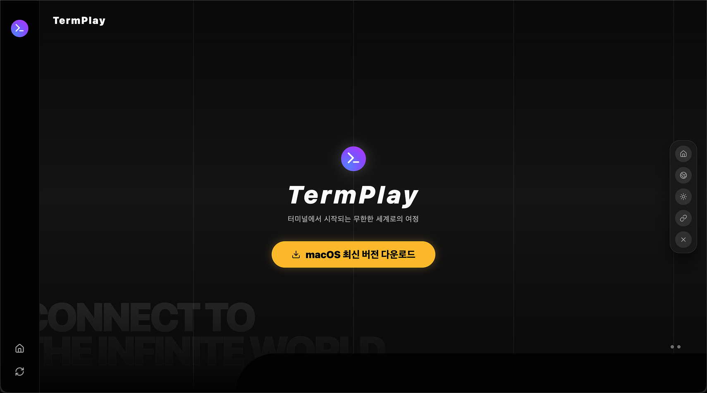
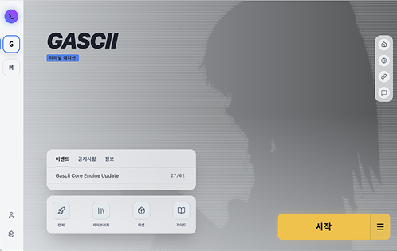
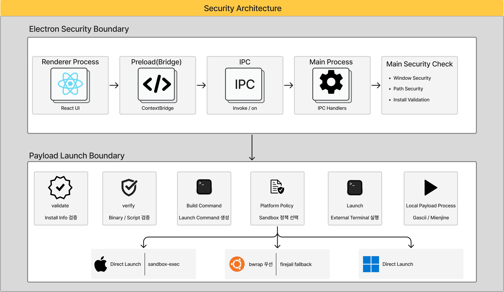
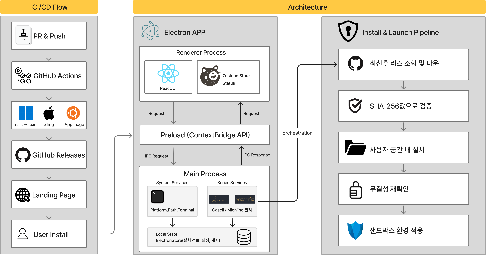
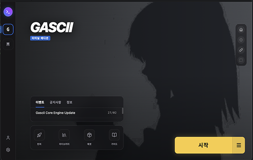

# TermPlay



터미널 기반 프로그램의 다운로드, 검증, 설치, 실행 과정을 하나의 UI로 통합한 Electron 기반 크로스플랫폼 런처

- 배포 URL: 준비 중
- GitHub Releases 기반 플랫폼별 바이너리 다운로드
- Windows / macOS / Linux 실행 흐름 지원

<!-- Hero GIF -->
<!-- 추천: 시리즈 선택 → 설치 진행 → 검증 완료 → 외부 터미널 실행 -->

**Tech Stack**


---

# 프로젝트 소개

터미널 기반 프로그램은 일반 사용자가 설치하고 실행하기 어렵습니다.

플랫폼마다 바이너리 형식, 실행 권한, 터미널 실행 방식이 다르고, Rust나 OpenCV 같은 네이티브 의존성이 있는 프로그램은 사용자가 직접 빌드 환경을 준비해야 하는 문제가 있었습니다.

TermPlay는 이러한 문제를 줄이기 위해 터미널 기반 콘텐츠의 **다운로드 → 검증 → 설치 → 실행** 흐름을 하나의 데스크톱 런처 안에서 처리하도록 설계했습니다.

단순히 실행 파일을 여는 앱이 아니라, 외부 바이너리를 안전하게 가져오고 검증한 뒤 사용자의 로컬 터미널에서 실행하는 크로스플랫폼 런처입니다.

---

# 주요 기능

## 1. 터미널 시리즈 설치 및 실행

Gascii, Mienjine 같은 터미널 기반 프로그램을 GUI에서 선택하고 설치할 수 있도록 구성했습니다.

- 시리즈 선택
- 설치 상태 확인
- 설치 / 검증 / 제거 지원
- 외부 터미널 실행 지원



---

## 2. GitHub Releases 기반 바이너리 다운로드

사용자 환경에서 직접 빌드하지 않아도 되도록, GitHub Releases에 업로드된 플랫폼별 바이너리를 내려받는 방식으로 구성했습니다.

- macOS arm64
- Windows x64
- Linux x86_64
- 최신 릴리스 조회
- 플랫폼별 asset 선택

기존처럼 GitHub Repository를 clone해서 로컬에서 빌드하는 방식은 Rust, OpenCV, 컴파일러 환경이 필요했습니다.

TermPlay는 이를 사전 빌드된 payload archive 다운로드 방식으로 전환해 사용자 설치 난이도를 줄였습니다.

---

## 3. 설치 파이프라인 표준화

다운로드한 파일을 바로 실행하지 않고, 단계별 검증을 거친 뒤 설치되도록 구성했습니다.

```text
시리즈 선택
  └─ 릴리스 조회
      └─ 바이너리 다운로드
          └─ SHA-256 검증
              └─ 아카이브 안전성 검사
                  └─ staging 압축 해제
                      └─ 최종 설치 경로 이동
                          └─ 설치 메타데이터 저장
                              └─ 외부 터미널 실행
```

압축 파일을 최종 경로에 바로 풀지 않고 staging 디렉터리에서 먼저 검증한 뒤 반영해, 손상 파일이나 중단 설치로 인한 문제를 줄였습니다.

---

## 4. 실행 경계 분리

Electron 앱에서 외부 실행 파일을 다루는 만큼, Renderer가 직접 파일 시스템이나 실행 권한에 접근하지 않도록 분리했습니다.

- Renderer는 UI와 상태 관리만 담당
- Preload는 제한된 API만 노출
- Main Process에서만 다운로드, 설치, 파일 검증, 외부 프로세스 실행 수행
- 설치 경로는 realpath 기반으로 검증
- 외부 링크 허용 도메인 제한



---

# Architecture



TermPlay는 Electron의 Renderer / Preload / Main 구조를 기준으로 역할을 분리했습니다.

Renderer는 React, Tailwind CSS, Zustand를 활용해 화면과 상태를 관리합니다.  
Preload는 contextBridge를 통해 Renderer가 사용할 수 있는 API를 제한적으로 노출합니다.  
Main Process는 GitHub Releases 조회, 파일 다운로드, 무결성 검증, 설치 경로 관리, 외부 터미널 실행을 담당합니다.

이를 통해 UI 영역과 로컬 실행 권한을 분리하고, Renderer 침해가 곧바로 Node API 접근이나 외부 payload 실행으로 이어지지 않도록 구성했습니다.

---

# 기술 결정

## Why Electron?

TermPlay는 단순 웹앱이 아니라 로컬 파일 시스템, 외부 터미널 실행, 플랫폼별 권한 처리, 네이티브 다이얼로그가 필요한 데스크톱 런처입니다.

Electron은 웹 기술 기반 UI를 유지하면서도 Main Process를 통해 OS 기능을 제어할 수 있기 때문에 TermPlay의 구조에 적합했습니다.

---

## Why GitHub Releases?

초기 구조는 GitHub Repository를 clone하고 사용자의 로컬 환경에서 프로그램을 빌드하는 방식이었습니다.

하지만 이 방식은 사용자가 Rust, OpenCV, 컴파일러, 플랫폼별 빌드 도구를 직접 준비해야 했기 때문에 런처의 목적과 맞지 않았습니다.

그래서 TermPlay는 GitHub Releases에 업로드된 사전 빌드 바이너리를 다운로드하는 방식으로 변경했습니다.

```text
Before
GitHub Repository Clone
  └─ 로컬 빌드
      └─ 실행

After
GitHub Releases
  └─ 플랫폼별 바이너리 다운로드
      └─ 검증
          └─ 설치
              └─ 실행
```

이 구조를 통해 사용자는 개발 환경을 설치하지 않아도 터미널 프로그램을 실행할 수 있습니다.

---

## Why Staging Install?

다운로드한 archive를 바로 최종 설치 경로에 압축 해제하면, 설치 도중 오류가 발생했을 때 손상된 상태가 남을 수 있습니다.

TermPlay는 이를 막기 위해 staging 디렉터리를 사용했습니다.

```text
.downloads
  └─ payload archive

staging
  └─ 검증 중인 설치 파일

final install path
  └─ 검증 완료 후 이동된 실행 파일
```

이 구조를 통해 설치 실패와 정상 설치 상태를 분리하고, 중단 설치로 인한 실행 오류를 줄였습니다.

---

## Why Renderer / Preload / Main Separation?

외부 터미널 콘텐츠 실행 특성상 Renderer 침해가 Node API 접근이나 외부 payload 실행으로 이어질 위험이 있었습니다.

이를 줄이기 위해 다음과 같이 권한 경계를 분리했습니다.

- Renderer: 화면 구성, 사용자 입력, 상태 표시
- Preload: contextBridge 기반 제한 API 제공
- Main: 파일 시스템 접근, 다운로드, 설치, 실행 담당

또한 BrowserWindow 설정에서 다음 옵션을 적용했습니다.

```ts
nodeIntegration: false
contextIsolation: true
sandbox: true
```

이 구조는 Renderer가 직접 Node API나 파일 시스템에 접근하지 못하도록 하고, 필요한 작업만 제한된 IPC 경로를 통해 Main Process에 요청하도록 만듭니다.

---

# Problem Solving

## 1. 사용자가 터미널 프로그램을 직접 설치하기 어렵다

### 문제

Gascii, Mienjine 같은 터미널 기반 프로그램은 일반 사용자가 직접 설치하고 실행하기 어렵습니다.

특히 플랫폼별 바이너리, 실행 권한, 터미널 실행 방식이 달라 사용자가 직접 환경을 맞춰야 했습니다.

### 원인

초기 방식은 Repository clone과 로컬 빌드에 의존했기 때문에 Rust, OpenCV, 컴파일러 등 개발 환경이 필요했습니다.

### 해결

- GitHub Releases 기반 플랫폼별 바이너리 다운로드 방식으로 변경
- 시리즈별 Release Resolver 구성
- 플랫폼별 asset 선택 로직 추가
- 다운로드, 검증, 설치, 실행 흐름을 하나의 파이프라인으로 통합

### 결과

사용자가 별도 빌드 환경을 준비하지 않아도 GUI에서 터미널 프로그램을 설치하고 실행할 수 있는 구조를 만들었습니다.

---

## 2. 릴리스 자산 구조가 달라 설치 흐름이 깨진다

### 문제

시리즈마다 release asset 이름, archive 구조, 실행 파일 위치가 다를 수 있어 하나의 고정된 설치 로직으로 처리하기 어려웠습니다.

### 원인

Gascii는 GitHub Releases에서 최신 릴리스를 조회해야 하고, Mienjine은 정적 메타데이터 기반으로 관리되는 등 시리즈별 release 관리 방식이 달랐습니다.

### 해결

- Release Resolver와 Installer 책임 분리
- 시리즈별 Service 구성
- 다운로드 URL, 체크섬, 실행 파일 경로, asset 이름을 메타데이터로 관리
- 설치 단계는 공통 파이프라인으로 표준화

### 결과

시리즈별 차이는 Resolver에서 처리하고, 설치 과정은 Installer에서 일관되게 처리할 수 있게 되었습니다.

---

## 3. Renderer 권한이 외부 실행 권한으로 확산될 수 있다

### 문제

Electron 앱에서 Renderer가 침해되면 Node API 접근이나 외부 실행 파일 실행으로 이어질 수 있는 위험이 있습니다.

### 원인

런처는 일반 앱보다 로컬 파일 접근, 다운로드, 압축 해제, 권한 부여, 외부 프로세스 실행이 많기 때문에 권한 경계가 명확하지 않으면 보안 리스크가 커집니다.

### 해결

- `nodeIntegration: false`
- `contextIsolation: true`
- `sandbox: true`
- contextBridge 기반 제한 API 구성
- 파일 시스템 / 설치 / 실행 작업은 Main Process 전용으로 분리
- realpath 기반 설치 경로 검증 추가
- 외부 링크 허용 도메인 제한

### 결과

Renderer, Preload, Main, 외부 실행 프로세스의 책임을 분리하고, UI 침해가 곧바로 로컬 실행 권한으로 이어지는 위험을 줄였습니다.

---

## 4. 플랫폼마다 터미널 실행 방식이 다르다

### 문제

macOS, Windows, Linux는 터미널 앱 실행 방식과 권한 처리 방식이 다릅니다.

Windows는 경로 quoting 문제가 발생할 수 있고, macOS는 실행 권한과 터미널 앱 선택 문제가 있으며, Linux는 배포 환경마다 터미널 명령이 달라질 수 있습니다.

### 원인

터미널 프로그램 실행은 단순히 binary path를 실행하는 문제가 아니라, 사용자의 로컬 터미널 앱과 OS별 프로세스 실행 규칙에 영향을 받습니다.

### 해결

- 플랫폼별 Terminal Launcher 분리
- 시리즈별 실행 경로 검증
- macOS 터미널 우선순위 처리
- Windows 실행 경로 quoting 문제 대응
- 실행 전 설치 무결성 확인

### 결과

플랫폼별 차이를 런처 계층에서 흡수하고, 사용자는 동일한 UI 흐름으로 터미널 프로그램을 실행할 수 있게 되었습니다.

---

# Validation

- 시리즈 설치 / 검증 / 제거 흐름 테스트
- GitHub Releases 최신 릴리스 조회 테스트
- 플랫폼별 asset 선택 로직 검증
- SHA-256 체크섬 검증
- staging 기반 설치 흐름 검증
- Renderer / Preload / Main IPC 흐름 검증
- 외부 터미널 실행 경로 검증
- macOS / Windows / Linux 패키징 검증

### Key Results

- Gascii / Mienjine 시리즈 설치 흐름 구성
- GitHub Releases 기반 플랫폼별 바이너리 다운로드 구조 전환
- SHA-256 기반 무결성 검증 적용
- staging 기반 안전 설치 파이프라인 구성
- Electron Renderer / Preload / Main 권한 경계 분리
- Windows / macOS / Linux 실행 흐름 대응
- GitHub Actions 기반 태그 릴리스 자동화 구성

---

# Screenshots

## Light Mode


## Dark Mode




---

# 실행 방법

## Development

```bash
pnpm install
pnpm run dev
```

## Build

```bash
pnpm run build
```

## Release Tag

```bash
git tag v0.1.0
git push origin v0.1.0
```

## macOS Release

```bash
GH_TOKEN=... pnpm run release:mac
```

---

# Future Work

- Windows 코드 서명 적용
- macOS notarization 자동화 안정화
- 설치 실패 복구 UX 개선
- GitHub API rate limit 대응
- 시리즈 플러그인 구조 확장
- 실행 로그 및 진단 리포트 강화
- 더 많은 터미널 기반 콘텐츠 지원

---

TermPlay는 터미널 프로그램을 단순히 실행하는 앱이 아니라, 설치와 실행 사이의 복잡한 과정을 사용자가 이해하지 않아도 되도록 감싸는 데스크톱 런처입니다.

저는 이 프로젝트를 통해 Electron 기반 데스크톱 앱에서 로컬 파일 시스템, 외부 바이너리, 플랫폼별 실행 방식, 보안 경계를 함께 다루는 런처 구조를 직접 설계하고 구현했습니다.