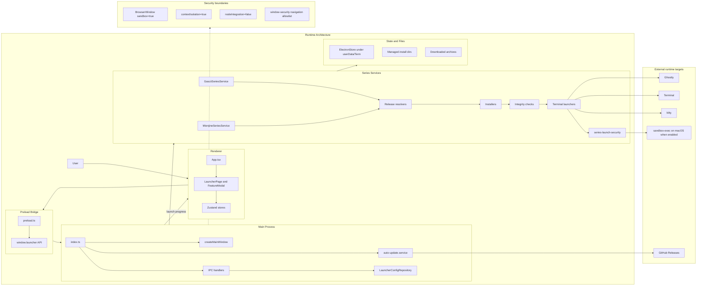
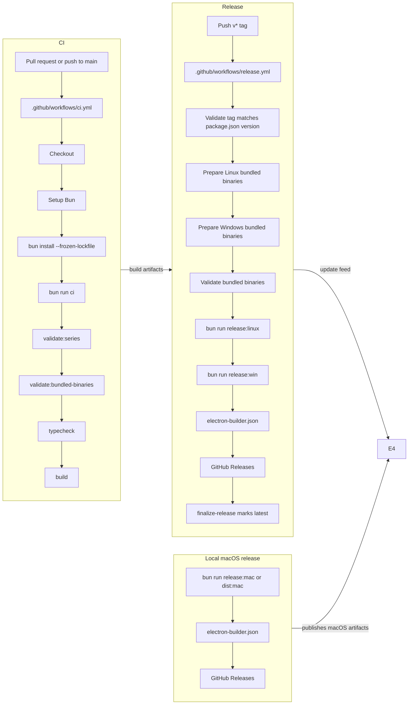
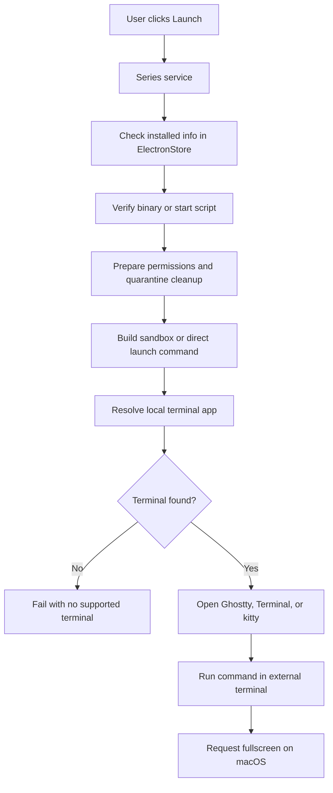

# TermPlay Architecture and CI/CD

## Architecture Overview

TermPlay is an Electron desktop launcher with three main runtime layers:

- Main process: app bootstrap, IPC handlers, window management, update checks.
- Preload bridge: type-safe `window.launcher` API exposed with `contextBridge`.
- Renderer: React UI backed by Zustand stores.

The runtime also has a shared service layer for Gascii and Mienjine. Both series follow the same install/launch pattern, but Gascii resolves the latest GitHub release while Mienjine uses the release metadata embedded in `series-definitions.ts`.

Important troubleshooting distinction: TermPlay does not install Ghostty, Terminal, or kitty from GitHub. Those terminal apps are expected to already exist on the machine. What comes from GitHub is the Gascii or Mienjine payload archive, which is then installed under the managed TermPlay root.

### Runtime flow in practice

1. The renderer calls `window.launcher.*`.
2. The preload bridge forwards the call to IPC.
3. The main process routes the request to the correct handler.
4. The series service resolves the release, downloads the archive, verifies it, extracts it, and stores install info.
5. Launch verifies the installed files again, then starts an external terminal session.
6. On packaged builds, `auto-update.service` checks GitHub Releases and installs updates on quit.

## CI/CD Pipeline

### CI/CD notes

- CI runs on pull requests and pushes to `main`.
- Release runs on `v*` tags and validates that the tag matches `package.json`.
- Linux and Windows release jobs bundle platform binaries before `electron-builder` runs.
- macOS releases are built locally with `bun run release:mac` or `bun run dist:mac`.
- `electron-builder.json` publishes to GitHub Releases, which is also what the runtime auto-update service checks.

## External Terminal Automation Troubleshooting

This is the part to use when the complaint is "the external terminal did not open" or "the app says it downloaded something from GitHub, but the terminal launch failed".

### What is sourced from GitHub

- Gascii: `gascii-release-resolver.ts` calls the GitHub latest release API, filters the matching platform asset, and requires a SHA-256 digest before install.
- Mienjine: `mienjine-release-resolver.ts` reads the static release definition in `series-definitions.ts`, builds the GitHub release asset URL, and installs that archive.
- Both installers verify the downloaded archive, reject unsafe tar entries, and block symlink tricks before extraction.

### What is local only

- Ghostty, Terminal.app, and kitty are not bundled and not downloaded by TermPlay.
- On macOS, the launchers probe existing local installs first, then fall back to `command -v`.
- If none of the expected terminal apps are installed, the launch path fails with a terminal-not-found error instead of trying to install one.

### Launch sequence

### Failure matrix

| Symptom | Likely cause | Where to look |
|---|---|---|
| Release lookup fails | GitHub API error, bad tag, rate limit | [gascii-release-resolver.ts](src/main/services/gascii-release-resolver.ts), [mienjine-release-resolver.ts](src/main/services/mienjine-release-resolver.ts) |
| Download fails | Network error or missing asset | [gascii-installer.ts](src/main/services/gascii-installer.ts), [mienjine-installer.ts](src/main/services/mienjine-installer.ts) |
| SHA-256 verification fails | Asset mismatch or corrupted download | [archive-install-utils.ts](src/main/services/archive-install-utils.ts) |
| Archive contains unsafe entry | Path traversal, absolute path, bad tar layout | [archive-install-utils.ts](src/main/services/archive-install-utils.ts) |
| Symlink rejected | Archive contains symbolic links | [archive-install-utils.ts](src/main/services/archive-install-utils.ts) |
| Launch says no supported terminal was found | Ghostty, Terminal.app, or kitty is not installed or not resolvable | [gascii-terminal-launcher.ts](src/main/services/gascii-terminal-launcher.ts), [mienjine-terminal-launcher.ts](src/main/services/mienjine-terminal-launcher.ts) |
| macOS sandbox error | `TERMPLAY_ENABLE_EXPERIMENTAL_MAC_SANDBOX=1` is set but `sandbox-exec` is missing | [processSandbox.ts](src/main/security/processSandbox.ts) |
| Sandbox disabled in production | The env var that disables sandbox was set in a production build | [processSandbox.ts](src/main/security/processSandbox.ts) |
| Quarantine cleanup warning | `xattr` could not remove `com.apple.quarantine` | [gascii-installer.ts](src/main/services/gascii-installer.ts), [mienjine-installer.ts](src/main/services/mienjine-installer.ts) |

### macOS-specific rules

- The installed executable or start script is chmoded to `755` before launch.
- The install root is passed through `xattr -dr com.apple.quarantine` on macOS.
- If experimental macOS sandboxing is enabled, TermPlay writes a sandbox profile into `.termplay-sandbox/` and launches through `sandbox-exec`.
- If sandboxing is not enabled, the command is launched directly.
- The fullscreen request is done with `osascript`; if that step fails, the terminal still launches and only the fullscreen request is logged as a warning.

### Quick mental model

1. GitHub supplies the app payload archive, not the terminal app.
2. TermPlay installs the payload into the managed Term root.
3. On launch, TermPlay checks the install, prepares permissions, then asks the local terminal app to execute the command.
4. If launch breaks, the failure is usually in one of four places: GitHub asset selection, archive validation, local terminal discovery, or macOS permission/sandbox handling.
